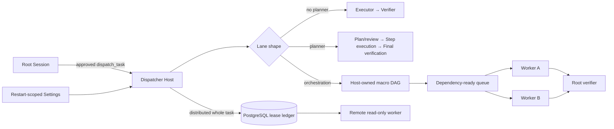

# dsh-task-dispatcher

**English** | [简体中文](./README.zh-CN.md)

An independent [DeepSeek Harness](https://github.com/deepseek-ai/deepseek-harness) bundle that sends bounded work to isolated child Sessions and requires independent model verification. A lane can use the classic executor-to-verifier pipeline, add an evaluator-gated adaptive plan, or opt into a Host-owned macro DAG whose dependency-ready Workers run concurrently.

The parent Session remains the control plane. Deployment-owned policy selects every model, tool, workspace, budget, retry, and acceptance criterion; models may propose work and evidence but cannot grant themselves authority.

**Start here:** [Quickstart](#quickstart) · [Core ideas](#core-ideas) · [Architecture](#architecture-at-a-glance) · [Basic usage](#basic-usage) · [Role models](#six-role-model-routes) · [Safety](#key-safety-boundaries) · [Documentation](#documentation)

## Quickstart

### 1. Add the public plugin to the Web profile

Prerequisites are Node.js `^22.19.0` or `>=24.0.0`, pnpm 11, and a working
DeepSeek Harness Web profile. The profile must already provide the standard
agents, jobs, settings, subagents, and tools services plus the model routes
used by your lanes.

```sh
cd /path/to/deepseek-harness
pnpm dsh plugin --profile web add github:c4pt0r/dsh-task-dispatcher
pnpm dsh --profile web --dump-config
```

The dump must contain one root row named `dsh-task-dispatcher`. Plugin
installation is profile-specific; adding it to another profile does not make
the Web client or Settings page available in `web`.

### 2. Start or restart the Web Host

Port 8317 is an explicit example, not a DSH default:

```sh
pnpm dsh web --port 8317
```

Open <http://127.0.0.1:8317>. Start or restart the Host after adding the plugin;
refreshing the browser alone does not activate Host policy changes. Choose a
different explicit port if 8317 is already in use.

### 3. Inspect policy in the Web UI

Open the URL printed by DSH, then go to **Settings → Plugins → Task
Dispatcher**. The bundled `general-analysis` lane is local, planner-enabled,
background by default, and intentionally read-only. It expects the bundled
DeepSeek provider names to exist in the selected Harness profile. Configure a
working credential for those routes (normally `DEEPSEEK_API_KEY`, or the
equivalent Models setting) before the first dispatch; a provider name alone
does not make model calls usable.

### 4. Dispatch a verified task

From an exact live root Session, ask naturally:

```text
Use dispatch_task with lane=general-analysis and run_in_background=true.
Title: Review pagination.
Objective: Review the audit-log pagination, identify concrete gaps, and verify
the findings independently. Do not modify the workspace.
```

The tool returns a dispatcher `taskId` and a Harness `jobId`. Use
`job_output({ job_id })` for a local background task. A completed Job means the
pipeline stopped; inspect the task result itself for `accepted`, `rejected`,
`blocked`, `cancelled`, or `error`.

### 5. Enable dynamic DAG planning when needed

Dynamic recursive orchestration is opt-in. Create a non-orchestrating,
read-only child lane, then enable **Safe subtask orchestration** on a parent
lane and select that child lane. Keep `maxPlanPatches > 0`, provide enough
shared node/model-run budget, save, and restart DSH. The Host may then revise
only the never-started part of the DAG when the in-flight Worker pool reaches a
quiescent boundary; running and completed nodes remain immutable. See
[Host-owned recursive orchestration](./docs/architecture.md#host-owned-recursive-orchestration-v1)
for the exact v1 boundary.

The bundled `general-analysis` lane is planner-enabled but **not** recursively
orchestrating. Unless an operator explicitly enables `orchestration` on a
separate lane, it continues to run one adaptive linear Master Plan rather than
creating concurrent Workers.

## Core ideas

1. **Models propose; the Host owns authority.** A model may propose a plan,
   patch, child DAG, or evidence. Only the Host selects routes, tools,
   workspaces, budgets, leases, plan revisions, and terminal status.
2. **Planning is hierarchical.** The Master describes outcomes, dependencies,
   contracts, coverage, and scheduling hints. A Worker receives one node and
   plans only that node. Neither role owns scheduling authority.
3. **Success requires independent verification.** Executor self-reports are
   evidence, never acceptance. A distinct verifier must cover every immutable
   criterion with a passing result and non-empty evidence.
4. **Policy is stronger than prompt text.** Objectives cannot select a model,
   add a tool, broaden a sandbox, change lanes, or mint recursive authority.
   Those choices come only from deployment-owned lane configuration.
5. **Plans are adaptive but effects are fenced.** Linear plans replace only
   their pending suffix. Recursive DAGs replace only never-started nodes at a
   quiescent scheduling boundary where no Worker remains in flight, after
   independent patch review and revision compare-and-set.
6. **Budgets decrease monotonically.** Depth, node, fan-out, concurrency,
   model-run, attempt, deadline, output, and lease limits are checked before
   publication. Started work never refunds model authority.
7. **Uncertainty fails closed.** Missing structured output, stale leases,
   invalid evidence, cleanup uncertainty, policy drift, or exhausted budgets
   cannot become accepted. Uncertain local cleanup quarantines the workspace.
8. **Durability is explicit, not implied.** Local plans and Jobs are
   process-local. Distributed v1 durably leases a complete read-only task, but
   does not checkpoint individual planner/executor/verifier phases.

## Architecture at a glance



The Master Planner describes outcomes, dependencies, contracts, and coverage. The Host validates that proposal, owns the plan revision and budgets, chooses ready work, and mints attenuated Worker grants. Each Worker sees only its node, directly required accepted evidence, global invariants, and the fixed child-lane policy.

| Mode | Shape | Parallelism | Recovery model |
|---|---|---|---|
| Local classic | One task-wide Executor, then an independent Verifier | One child phase at a time | Process-local |
| Local adaptive | Ordered plan with reviewed pending-suffix replacement | One plan step at a time | Process-local |
| Local orchestration | Contract-bearing macro DAG with bounded checkpoints | Dependency-ready Worker pool | Process-local |
| Distributed v1 | One remote worker runs one complete read-only pipeline | Across whole tasks | Durable envelope, lease, cancellation, and terminal result |

Recursive orchestration v1 is deliberately local, `spawn`, and read-only. Distributed v1 deliberately leases a whole task rather than splitting one DAG across machines. Writable recursive workspaces exist only as experimental Host libraries and are not active dispatcher capabilities.

Read the full [architecture and execution model](./docs/architecture.md), including the dynamic checkpoint protocol, Worker information boundary, scheduling policy, public Host modules, and truthful Web progress contract.

## Choose an execution shape

- Use a **classic lane** for one bounded implementation or review followed by independent acceptance.
- Use an **adaptive lane** when work is ordered but the never-executed suffix may need revision as verified evidence arrives.
- Use an **orchestration lane** when the root objective has independently verifiable branches with explicit inputs, outputs, dependencies, and a final synthesis.
- Use **distributed mode** when complete read-only tasks need durable queueing or placement across trusted worker processes.

Configuration determines physical authority. An objective cannot turn a linear lane into a DAG, select a child lane, demand a Worker count, choose a provider, or widen tools. The Host normally backfills released orchestration capacity, then drains to a bounded quiescent checkpoint only when safe replan budget and never-started work remain.

## Basic usage

Ask naturally from an exact live root Session, for example:

```text
Use the general-analysis dispatcher lane to review the audit-log pagination.
Identify concrete implementation gaps and focused tests. Also require the
acceptance criterion "empty-page": verify that requesting a page after the
last result returns an empty list.
Run it in the background.
```

The corresponding tool input is:

```json
{
  "lane": "general-analysis",
  "title": "Audit log pagination review",
  "objective": "Review pagination for the audit log and identify concrete gaps and tests.",
  "context": "Preserve the existing response shape.",
  "deliverables": [
    { "id": "findings", "description": "Concrete review findings" },
    { "id": "test-plan", "description": "Focused test recommendations" }
  ],
  "acceptance_criteria": [
    { "id": "empty-page", "text": "A page after the final result returns an empty list." }
  ],
  "run_in_background": true
}
```

Only `lane`, `title`, and `objective` are required. `run_in_background` defaults to the deployment's `defaultRunInBackground`, which is `true` in the bundled profile.

### Work on live web sources

The bundled lane lists `web_fetch` among its executor and verifier tools, so an
objective may name a URL without any lane editing. The tool itself belongs to
the Host, not to this plugin: a deployment that does not mount
[`dsh-tool-web`](https://github.com/deepseek-ai/deepseek-harness/tree/main/packages/web/tool-web)
with fetch enabled runs the same lane without it. Absent tools are dropped from
the child rather than aborting it, and are named in
`deployment_capabilities_json.unavailableTools` so an executor returns `blocked`
instead of inventing a page it never read.

The DSH `web` profile ships `tool-web` disabled. To enable fetch there, add a
fetch provider to the profile and re-enable the row in its `cordis.patch.yml`:

```sh
pnpm dsh plugin --profile web add @deepseek-ai/dsh-web-fetch-http
```

```yaml
- id: tool-web
  disabled: false
  config:
    search: false   # `web_search` needs a search provider and its credential
    fetch: true

- insert:
    - id: web-fetch-http
      name: '@deepseek-ai/dsh-web-fetch-http'
```

Restart the Host afterwards. See
[Example 3](./docs/examples.md#example-3-summarize-a-live-web-page).

A live source is the one case where an executor and its independent verifier
can honestly disagree: the verifier re-fetches the page to check the claim, and
by then the page has moved. Verifiers are told to treat that as drift rather
than fabrication, and to fail only for content that could not have come from
the source at any time. Drift still costs accuracy, so keep the pipeline short
for this kind of task — `maxPlanSteps: 2` holds the executor's fetch and the
final verifier's re-fetch minutes apart instead of a quarter hour.

### Follow or cancel the task

| Dispatch kind | Initial identity | Inspect progress/result | Cancel |
|---|---|---|---|
| Local foreground | `taskId` in the returned result | The tool waits for the terminal result | Cancel the calling turn |
| Local background | `taskId` plus Harness `jobId` | `job_list`, then `job_output({ job_id })` | `job_kill({ job_id })` |
| Distributed | Durable `taskId` | `dispatch_status({ task_id })` | `dispatch_cancel({ task_id })` |

Cancellation is cooperative: it revokes authority and starts bounded cleanup.
Read the Job output or distributed status again to confirm the terminal state;
a cancel request is not an immediate process kill.

Local foreground results have `kind: "foreground"` and a task status of
`accepted`, `rejected`, `blocked`, `cancelled`, or `error`. They include
`failureClass` (`none`, `task`, or `infrastructure`), executor and verifier
child run ids, and reports. Planner-enabled results additionally include
planner runs, plan-review runs, and the Host-owned `masterPlan` with its
revision and history. A distributed dispatch instead returns
`kind: "distributed"` and `queued`, `running`, or `terminal` state.

### Interpret the result

- `accepted` plus `modelVerified: true` means the applicable independent
  verifier passed every immutable criterion with evidence.
- `rejected` means a verifier or plan reviewer rejected the proposal, evidence,
  or result; an executor may not have started.
- `blocked` means the pipeline reported a concrete blocker.
- `cancelled` means the authority chain was cancelled and cleaned up.
- `error` means a task or infrastructure boundary failed; inspect
  `failureClass`, `message`, and `workspaceQuarantined`.

At the Jobs layer, a finished `rejected` or `blocked` task is still a completed
job—the task's JSON output contains the semantic result. Only dispatcher
infrastructure errors fail the job, and a successful cooperative cancellation
settles the background job as killed.

## Policy activation lifecycle

1. Define or edit a deployment-owned lane in the Web Settings page or profile configuration.
2. Save the revision-fenced draft. A conflicting tab or manual edit is refused rather than overwritten.
3. Restart the DSH Host. Browser refresh alone does not activate policy.
4. Verify the composed profile with `--dump-config` and confirm every provider route is usable.
5. Dispatch from the exact root Session and approve the normal Harness tool boundary.
6. Inspect the semantic task status, model-verification flag, evidence, and failure class—not only the Job wrapper state.

Base lanes can be overridden but not deleted in the user layer. Invalid object-shaped plugin policy is never activated: the Host exposes a repair-required fallback so the Settings page can correct or reset it. Malformed YAML or a non-object namespace may require manual repair before composition.

Provider credentials and PostgreSQL connection strings stay outside the browser document. Settings edit only route names and `databaseUrlEnv`; environment values are never returned to the client.

## Six role model routes

Open **Settings → Plugins → Task Dispatcher**, expand a lane, and configure the model route for each runtime role. Every route contains `provider`, `model`, and `maxTokens`.

| Role | Route or fallback | Responsibility | Tool authority |
|---|---|---|---|
| Master Planner | `planner` | Proposes the initial linear plan or macro DAG | `plannerTools` |
| Plan Reviewer | `planReviewer` → `verifier` | Independently accepts or rejects initial and patched plans | `verifierTools` |
| Replanner | `replanner` → `planner` | Keeps, blocks, or proposes a bounded pending replacement | `plannerTools` |
| Executor | `executor` | Performs one task attempt in a classic or adaptive lane | `executorTools` |
| Step Verifier | `verifier` | Evaluates one executor attempt or completed node | `verifierTools` |
| Final Verifier | `finalVerifier` → `verifier` | Evaluates the immutable root task and all original criteria | `verifierTools` |

The three specialized routes are optional overrides, so older three-route lanes keep the same behavior. A role-specific planning route requires `planner`. On a user-created lane, turning planning off atomically removes the Planner and all three specialized overrides because those roles no longer run. A composition-owned base lane cannot remove its base Planner; a specialized route supplied by the base can be edited but cannot be removed back to fallback from the user layer. **Reset to profile defaults** restores the profile base.

Model selection never changes tool authority. The Master Planner and Replanner share `plannerTools`; all reviewer roles share `verifierTools`. Recursive Worker nodes use the complete configuration of the deployment-owned `childLane`, so change that lane to change Worker models.

Saving Settings writes a revision-fenced user override but does not hot-reload the Host. Restart DSH before expecting a new route, tool list, budget, or placement policy to affect newly dispatched tasks. Existing work keeps the policy activated for its process.

The complete field tables, defaults, validation rules, Settings ownership model, and dynamic-DAG YAML are in [Configuration and usage](./docs/configuration.md).

## Key safety boundaries

- **Root-only admission.** Raw dispatch calls are accepted only from the exact live root Session. Children cannot recursively invoke dispatcher, workflow, subagent, Ralph, or global-rule mutation tools.
- **Independent acceptance.** Executor claims are evidence, not success. Acceptance requires one result for every immutable criterion, every result passing, and every pass carrying non-empty evidence.
- **Deployment-owned policy.** Lanes—not prompts—select model routes, tools, workspaces, retries, timeouts, orchestration, and distribution.
- **Read-only planning and review.** Planner and verifier tool lists are restricted to `read`, `read_image`, `glob`, and `grep`.
- **Bounded authority.** Attempts, plan steps, patches, child/model runs, DAG depth, fan-out, concurrency, deadlines, outputs, and leases are checked before work starts.
- **Immutable completed work.** Linear plans replace only their pending suffix. Macro-DAG patches can replace only never-started nodes at a successful quiescent boundary and must pass independent review plus revision compare-and-set.
- **Workspace fencing.** Mutating lanes require exact `workspace-write` scope and a protected `liveRoot`. Uncertain local cleanup quarantines the workspace for the rest of the process.
- **Read-only distribution.** Remote v1 tasks may use only built-in read tools. Lease fencing prevents stale publication but cannot provide exactly-once external effects.
- **Fail closed.** Invalid configuration, structured-output failure, refusal, timeout, stale lease, policy drift, exhausted budget, cleanup uncertainty, or unexpected pipeline error cannot become `accepted`.
- **Normal approval remains.** Dispatch still passes through the Harness **Allow once** approval boundary.

Child Sessions provide logical isolation inside the same Node process, not an operating-system security boundary. Run DSH under an external supervisor for process and machine recovery. Local Jobs, plans, locks, circuits, and live Web projections are process-local; distributed PostgreSQL state is durable but individual model phases are not checkpointed.

For staging-only self-improvement, workspace quarantine, process supervision, operational limits, and release checks, read [Security, self-improvement, and operations](./docs/security-and-operations.md).

## Web execution view

The Web client adds a compact per-conversation summary and a detailed task view. It distinguishes a root Master Plan from Worker node-local execution, renders published dependency edges, shows Host-reported active Agents, and separates mechanically dependency-ready work from admitted or running work.

The view does not invent queue rank, slot occupancy, critical path, ETA, remote phase, child Agent, or model data that Host telemetry did not publish. A Job marked completed means only that its wrapper stopped; semantic success still requires `status: "accepted"` and `modelVerified: true`.

Snapshots are bounded, Session-filtered, and loopback-only. They omit prompts, workspace paths, criterion evidence, and other large or sensitive payloads. See the [full Web progress contract](./docs/architecture.md#web-execution-view).

<!-- Compatibility anchors retained after the detailed reference moved into docs/. -->
<a id="architecture"></a>
<a id="internal-code-boundaries"></a>
<a id="what-it-guarantees"></a>
<a id="execution-modes-and-master-plans"></a>
<a id="host-owned-recursive-orchestration-v1"></a>
<a id="master-host-and-worker-information-boundaries"></a>
<a id="public-host-side-planning-modules"></a>
<a id="distributed-read-only-execution-v1"></a>
<a id="postgresql-and-process-roles"></a>
<a id="admission-delivery-leases-and-cancellation"></a>
<a id="restart-and-availability-semantics"></a>
<a id="web-configuration"></a>
<a id="usage-guide"></a>
<a id="choose-when-to-use-the-macro-dag"></a>
<a id="install-locally"></a>
<a id="dispatch-a-task"></a>
<a id="usage-examples"></a>
<a id="example-1-run-a-focused-repository-review-in-the-background"></a>
<a id="example-2-wait-for-a-small-verified-decision"></a>
<a id="example-3-let-a-master-planner-expose-parallel-read-only-work"></a>
<a id="example-4-inspect-or-cancel-a-durable-distributed-task"></a>
<a id="example-5-dispatch-a-local-write-task-only-through-an-explicit-write-lane"></a>
<a id="configure-lanes"></a>
<a id="enable-a-dynamic-read-only-master-plan"></a>
<a id="safe-self-improvement"></a>
<a id="availability-and-failure-boundary"></a>
<a id="task-level-logical-isolation"></a>
<a id="process--and-machine-level-availability"></a>
<a id="operational-limits"></a>
<a id="test-and-package"></a>

## Documentation

| Guide | Use it for |
|---|---|
| [Documentation index](./docs/README.md) | Reading paths and the complete guide map |
| [Architecture and execution model](./docs/architecture.md) | Pipelines, macro DAGs, scheduling, verification, public modules, and progress telemetry |
| [Configuration and usage](./docs/configuration.md) | Settings, dispatch lifecycle, lane fields, role routes, budgets, and orchestration YAML |
| [Distributed read-only execution](./docs/distributed.md) | PostgreSQL roles, pools, workspace mappings, leases, cancellation, and recovery |
| [Examples](./docs/examples.md) | Copy-ready local, orchestration, distributed, and authorized write requests |
| [Security, self-improvement, and operations](./docs/security-and-operations.md) | Staging boundaries, containment, supervision, quarantine, and limits |
| [Development](./docs/development.md) | Source installation, generated client bundle, tests, package checks, and release workflow |

## Development

The repository commits its generated `lib/client.js` and source map so Git and file installations do not require build-time developer dependencies. Contributors should rebuild and run the documented validation suite before committing.

See [Development](./docs/development.md) for source installation, bundle ownership, test commands, package validation, and publishing notes.

## License

[MIT](./LICENSE)
