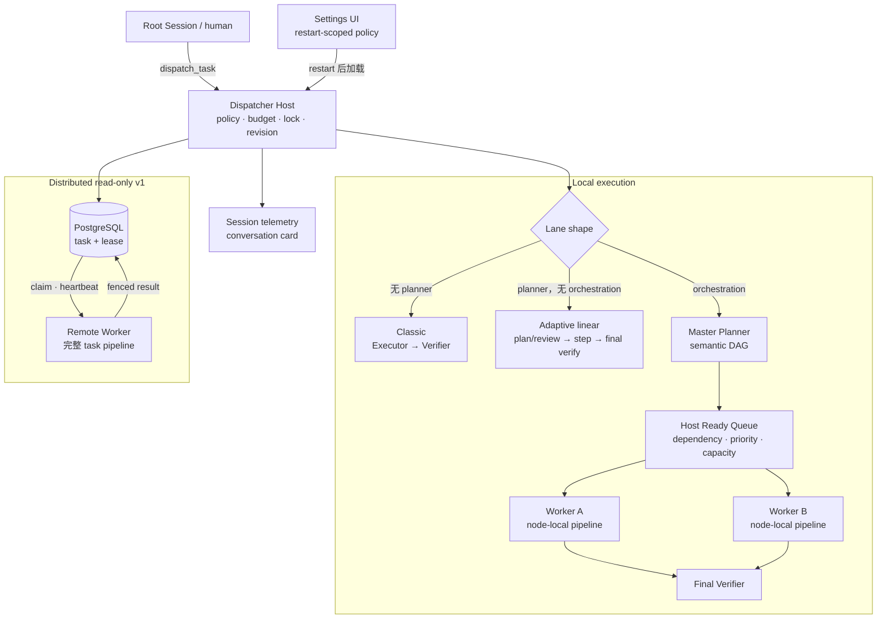

# dsh-task-dispatcher

[English](./README.md) | [简体中文](./README.zh-CN.md)

一个独立的 [DeepSeek Harness](https://github.com/deepseek-ai/deepseek-harness) 插件包，把有明确边界的工作发送到隔离 child Session，并要求独立模型验证结果。

一个 Lane 可以使用经典 Executor → Verifier pipeline，也可以加入 read-only Planner 来维护受预算与 review 约束的动态计划，还可以启用分层 orchestration：Master Planner 提出 coarse semantic DAG，Host 选择 dependency-ready work，每个 Worker 只聚焦一个 node。

每个 Lane 独立拥有 model route、tool allow-list、retry/planning budget、timeout 与 mandatory acceptance criterion。默认 local execution；可选 distributed read-only mode 通过 PostgreSQL 把完整任务租给 remote DSH Worker。

parent Session 始终是 control plane。执行与验证发生在 child Session，不会让竞争模型并发写入同一个 parent Session。

**快速导航：** [Quickstart](#quickstart) · [核心理念](#核心理念) · [架构](#架构) ·
[基本用法](#基本用法) · [六个模型角色](#六个模型角色) ·
[动态 DAG 与并发 Worker](#动态-dag-与并发-worker) · [安全边界](#关键安全边界) ·
[中文详细文档](#中文详细文档)

## Quickstart

### 1. 添加 public plugin

前置条件：Node.js `^22.19.0` 或 `>=24.0.0`、pnpm 11，以及可工作的 DeepSeek Harness Web profile。profile 必须提供 agents、jobs、settings、subagents、tools 服务和 Lane 使用的 model route。

```sh
cd /path/to/deepseek-harness
pnpm dsh plugin --profile web add github:c4pt0r/dsh-task-dispatcher
pnpm dsh --profile web --dump-config
```

dump 必须包含名为 `dsh-task-dispatcher` 的 root row。plugin installation 是 profile-specific；添加到其他 profile 不会让 `web` profile 获得 Web client 或 Settings 页面。

### 2. 启动或重启 Web Host

```sh
pnpm dsh web --port 8317
```

打开 <http://127.0.0.1:8317>。8317 只是示例端口，不是 DSH default。

添加 plugin 或修改 Settings 后必须 restart Host。refresh browser 不会激活 Host policy change；existing task、child、Worker 和 claim loop 继续使用 process 启动时的 policy。

### 3. 检查配置

进入 **Settings → Plugins → Task Dispatcher**。内置 `general-analysis` Lane 是 local、planner-enabled、background-by-default、read-only，但**没有**开启 recursive orchestration。

它使用 `deepseek-official` route。首次 dispatch 前，请配置可用 credential（通常是 `DEEPSEEK_API_KEY` 或等价 Models setting）；provider name 本身不能完成 model call。

### 4. Dispatch verified task

在 exact live root Session 中提出：

```text
Use dispatch_task with lane=general-analysis and run_in_background=true.
Title: Review pagination.
Objective: Review the audit-log pagination, identify concrete gaps, and verify
the findings independently. Do not modify the workspace.
```

local background response 返回 dispatcher `taskId` 和 Harness `jobId`。使用 `job_output({ job_id })` 读取结果。

Job `completed` 只表示 wrapper 已停止。semantic success 必须同时满足 task `status: "accepted"` 与 `modelVerified: true`。

## 核心理念

1. **Models propose；Host owns authority。** 模型可以提出 plan、patch、DAG 或 evidence；只有 Host 能选择 route、tool、workspace、budget、lease、revision 和 terminal status。
2. **Planning is hierarchical。** Master 描述 outcome、dependency、contract 与 coverage；Worker 只为当前 node 规划。两者都不拥有 scheduling authority。
3. **Success requires independent verification。** Executor self-report 是 evidence，不是 acceptance；独立 Verifier 必须覆盖所有 immutable criterion，并为每个 pass 提供非空 evidence。
4. **Policy 高于 prompt。** objective 不能选择 model、添加 tool、扩大 sandbox、改变 Lane、指定 Worker 数或生成 recursive authority。
5. **Plan 可调整，effect 被隔离。** linear plan 只能替换 pending suffix；recursive DAG 只能在 quiescent boundary 替换 never-started node。
6. **Budget 单调减少。** depth、node、fan-out、concurrency、model-run、attempt、deadline、output 和 lease 都在 Host publication 前检查。
7. **Uncertainty fails closed。** malformed output、stale lease、invalid evidence、cleanup uncertainty、policy drift 或 exhausted budget 都不能变成 accepted。
8. **Durability 必须显式。** local plan/Job 是 process-local；distributed v1 只持久 complete task lease，不 checkpoint 单独 phase。

## 架构



| 模式 | Plan | 并行度 | Recovery |
|---|---|---|---|
| Local classic | 无；Executor 后接 Verifier | 每次一个 child phase | process-local |
| Local adaptive | ordered Master Plan | 每次一个 step | process-local |
| Local orchestration | contract-bearing macro DAG | dependency-ready rolling Worker pool | process-local |
| Distributed v1 | 一个 Worker 运行完整 classic/adaptive pipeline | whole task 之间并行 | durable envelope/lease/result；整条 pipeline 重跑 |

详细状态机、信息边界与 module 拆分见[架构与执行模型](./docs/zh-CN/architecture.md)。

## 它保证什么

- `planner` omitted 时运行 isolated Executor → independent Verifier。
- `planner` configured 时，initial plan 必须 structured、覆盖原始 criterion/deliverable，并通过 independent plan review。
- 一次只执行一个 linear step；Host 才能把 step 标为 completed。
- Planner 只能保留 plan、报告 blocker 或替换 pending suffix；patch 必须 review + revision CAS。
- 所有 step/node 完成后，Final Verifier 对 immutable original task 做 global verification。
- 每个 criterion 必须恰好得到一个 `pass` 和非空 evidence，才返回 `accepted` + `modelVerified: true`。
- malformed plain Markdown Planner output 不会被当作 protocol plan。
- Host-generated task id、workspace lock、bounded run/deadline/output 与 exact cleanup 都 fail closed。
- Harness 仍会显示普通 **Allow once** approval。

accepted 表示 model-verified，不代表形式化证明、安全认证或 human approval。

## 基本用法

只有 `lane`、`title`、`objective` 必填：

```json
{
  "lane": "general-analysis",
  "title": "Audit log pagination review",
  "objective": "Review pagination for the audit log and identify concrete gaps and tests.",
  "context": "Preserve the existing response shape.",
  "deliverables": [
    { "id": "findings", "description": "Concrete review findings" },
    { "id": "test-plan", "description": "Focused test recommendations" }
  ],
  "acceptance_criteria": [
    { "id": "empty-page", "text": "A page after the final result returns an empty list." }
  ],
  "run_in_background": true
}
```

caller 可以添加更严格 criterion，但不能移除 Lane mandatory criterion。

### 跟踪与取消

| Dispatch kind | Identity | 查看 | 取消 |
|---|---|---|---|
| Local foreground | result 中的 `taskId` | tool 等待 terminal result | cancel calling turn |
| Local background | `taskId` + `jobId` | `job_list`、`job_output({ job_id })` | `job_kill({ job_id })` |
| Distributed | durable `taskId` | `dispatch_status({ task_id })` | `dispatch_cancel({ task_id })` |

cancellation 是 cooperative，不是 immediate process kill。local Jobs tool 使用 `jobId`，不能使用 dispatcher `taskId`。

### 结果

| Status | 含义 |
|---|---|
| `accepted` | independent Verifier 通过全部 criterion；同时应为 `modelVerified: true` |
| `rejected` | Plan Reviewer 或 Verifier 拒绝 proposal/evidence/result |
| `blocked` | pipeline 报告具体 blocker |
| `cancelled` | authority chain 已取消并 cleanup |
| `error` | task/infrastructure boundary 失败；检查 `failureClass` 与 `workspaceQuarantined` |

完整场景见[使用示例](./docs/zh-CN/examples.md)。

## 六个模型角色

Settings 为每个 runtime Agent role 提供独立 model card：

| Role | Field | Default/fallback | Tool policy |
|---|---|---|---|
| Master Planner | `planner` | optional；omitted 使用 classic pipeline | `plannerTools` |
| Plan Reviewer | `planReviewer` | optional → `verifier` | `verifierTools` |
| Replanner | `replanner` | optional → `planner` | `plannerTools` |
| Executor | `executor` | required | `executorTools` |
| Step Verifier | `verifier` | required | `verifierTools` |
| Final Verifier | `finalVerifier` | optional → `verifier` | `verifierTools` |

三个 specialized route 只有 `planner` 存在时才合法。user-created Lane 关闭 Planner 时会原子删除 Planner 和三个 specialized override；composition-owned base Lane 不能删除 base Planner，也不能把 base 已提供的 specialized route 从 user layer 删除回 fallback。**Reset to profile defaults** 恢复 profile base。改变 role model 不会扩大 tool allow-list。

orchestration root 只直接使用 parent Lane 的 Master Planner、Plan Reviewer、Replanner、Final Verifier。DAG Worker 使用固定 `childLane` 的完整 role 配置；parent Executor/Step Verifier 不直接执行 node。要改变 Worker model，应修改 `childLane`。

详细字段与 budget 见[配置参考](./docs/zh-CN/configuration.md)。

## 动态 DAG 与并发 Worker

dynamic recursive orchestration 是 opt-in。v1 仅支持 local + `spawn` + read-only `workspaceMode: read-shared`。

Master Planner 只提出 semantic node、dependency、contract 与 root coverage；Host Scheduler 根据 dependency readiness、critical path、unlock value 与 capacity admission work。Worker 只看到当前 node contract 和直接 dependency evidence。

`maxConcurrentNodes` 是上限，不是要求 Master 启动固定数量。某个 Worker settle 而其他 Worker 仍在运行时，Host 会立即 backfill 新解锁的 ready work。

一次 backfill 后，如果仍有 unstarted node 且 patch/model-run budget 足够，Host 关闭新 admission，让 in-flight pool 自然排空。只有在 quiescent boundary，Replanner 才能通过 independent review + revision CAS 替换 never-started DAG。running/completed node 不可修改；failure 与 Final Verifier gap 不触发 DAG replan。

最小 parent/child 结构：

```yaml
dsh-task-dispatcher:
  lanes:
    analysis-leaf:
      kind: general
      transport: spawn
      execution: { mode: local }
      executor: { provider: deepseek-official, model: deepseek-v4-pro, maxTokens: 32000 }
      verifier: { provider: deepseek-official, model: deepseek-v4-flash, maxTokens: 12000 }
      executorTools: [read, glob, grep]
      verifierTools: [read, glob, grep]
      requiredCriteria:
        - { id: leaf-evidence, text: The child objective has concrete evidence. }

    analysis-orchestrator:
      kind: general
      transport: spawn
      execution: { mode: local }
      planner: { provider: deepseek-official, model: deepseek-v4-flash, maxTokens: 12000 }
      executor: { provider: deepseek-official, model: deepseek-v4-pro, maxTokens: 32000 }
      verifier: { provider: deepseek-official, model: deepseek-v4-flash, maxTokens: 12000 }
      plannerTools: [read, glob, grep]
      executorTools: [read, glob, grep]
      verifierTools: [read, glob, grep]
      requiredCriteria:
        - { id: requirements, text: All root requirements have evidence. }
      orchestration:
        enabled: true
        childLane: analysis-leaf
        maxDepth: 2
        maxTaskNodes: 8
        maxChildrenPerNode: 4
        maxConcurrentNodes: 2
        maxTotalModelRuns: 32
        workspaceMode: read-shared
```

Save 后 restart Host，再用 `lane=analysis-orchestrator` dispatch。完整配置与角色 override 见[配置参考](./docs/zh-CN/configuration.md#启用动态只读-master-plan)。

## 分布式只读 v1

distributed mode 把完整 task 租给单一 Worker；parallelism 发生在 whole task 之间，不会把一棵 DAG 跨 machine 拆分。

- 仅允许 `general` + `spawn` + read-only Lane；
- background-only；返回 durable `taskId`，没有 `jobId`；
- `dispatch_status`/`dispatch_cancel` owner-fence 到 exact origin Session；
- PostgreSQL 持久 envelope、lease、cancel flag、terminal result；
- 不持久 Worker phase、child Agent 或 live Master Plan；
- delivery 是 at-least-once；lease loss 后整条 pipeline 重跑；
- stale Worker 由 generation + bearer-token hash fencing，不能覆盖新 lease。

部署、PostgreSQL 与 restart 语义见[分布式只读执行](./docs/zh-CN/distributed.md)。

## Web execution view

conversation header 会显示类似 `Plan 2/5 · 1 active Agent` 的摘要，并区分 root Master Plan 与 Worker node-local execution。视图可显示 node state、reported dependency、running Agent、provider/model、durable placement/lease 和 terminal verification。

`Dependencies met` 只表示 published prerequisite 已由 Host 确认完成，不代表 node 已进入 Ready Queue、取得 slot 或将下一个运行。视图不会推测 queue rank、slot utilization 或 ETA。

distributed Worker 的 live phase 不持久，所以 remote card 显示 `Running remotely (phase unreported)`，不会虚构 Agent。

## 关键安全边界

- Planner/Verifier tool 始终限制为 `read`、`read_image`、`glob`、`grep`。
- raw `dispatch_task`、`dispatch_status`、`dispatch_cancel`、`subagent`、`subagent_fork`、`workflow`、`ralph`、`prompt_rewrite_rules`、`trigger_rules` 不能进入 Executor allow-list。
- 只有显式 local Lane Executor 可以配置 non-read-only tool；必须使用 protected `liveRoot`、exact `workspace-write` sandbox，且 workspace 与 live root 不重叠。
- `danger-full-access`、broader sandbox root 或 missing workspace 会 fail closed。
- recursive orchestration 与 distributed v1 都不可写；`isolated-write` 是 reserved value，Host 会拒绝。
- `workspace-isolation` 与 `config-proposals` 只是 experimental library，没有连接 `dispatch_task` 或 Settings save path。
- cleanup uncertainty 会设置 `workspaceQuarantined: true` 并保留 local lock，直到 process restart。

完整 writable Lane、self-improvement、availability 与 operational limit 见[安全与运维](./docs/zh-CN/security-and-operations.md)。

<!-- 详细参考迁移到 docs/ 后保留的旧 README 深链接兼容锚点。 -->
<a id="1-将公开插件添加到-web-profile"></a>
<a id="3-在-web-ui-中检查-policy"></a>
<a id="4-dispatch-一个带验证的任务"></a>
<a id="5-按需启用动态-dag-规划"></a>
<a id="内部代码边界"></a>
<a id="执行模式与-master-plan"></a>
<a id="由-host-持有的递归编排v1"></a>
<a id="masterhost-与-worker-的信息边界"></a>
<a id="公开的-host-side-planning-module"></a>
<a id="分布式只读执行v1"></a>
<a id="postgresql-与-process-role"></a>
<a id="admissiondeliverylease-与-cancellation"></a>
<a id="重启与可用性语义"></a>
<a id="web-执行视图"></a>
<a id="web-配置"></a>
<a id="使用指南"></a>
<a id="何时使用宏观-dag"></a>
<a id="本地安装"></a>
<a id="dispatch-任务"></a>
<a id="跟踪或取消任务"></a>
<a id="解读结果"></a>
<a id="使用示例"></a>
<a id="示例-1后台运行聚焦的-repository-review"></a>
<a id="示例-2等待一个小型-verified-decision"></a>
<a id="示例-3让-master-planner-识别可并行的只读工作"></a>
<a id="示例-4查看或取消-durable-distributed-task"></a>
<a id="示例-5仅通过显式-write-lane-dispatch-本地写任务"></a>
<a id="配置-lane"></a>
<a id="启用动态只读-master-plan"></a>
<a id="安全的-self-improvement"></a>
<a id="配置与安全边界"></a>
<a id="可用性与故障边界"></a>
<a id="task-level-逻辑隔离"></a>
<a id="process--与-machine-level-可用性"></a>
<a id="运行限制"></a>
<a id="测试与打包"></a>

## 中文详细文档

| 文档 | 内容 |
|---|---|
| [中文文档索引](./docs/zh-CN/README.md) | 阅读路线与版本边界 |
| [架构与执行模型](./docs/zh-CN/architecture.md) | state machine、Master/Host/Worker boundary、rolling backfill、Web progress |
| [配置参考](./docs/zh-CN/configuration.md) | 六角色、Lane、budget、tool、orchestration 与 Settings |
| [分布式只读执行](./docs/zh-CN/distributed.md) | coordinator/worker、PostgreSQL、lease、recovery |
| [安全与运维](./docs/zh-CN/security-and-operations.md) | write boundary、self-improvement、quarantine、availability |
| [使用示例](./docs/zh-CN/examples.md) | foreground/background、DAG、distributed、write Lane |
| [开发、测试与发布](./docs/zh-CN/development.md) | source install、bundle、test、package verification |

## 开发与测试

```sh
pnpm install --frozen-lockfile
pnpm run typecheck
pnpm lint
pnpm test
pnpm run bundle
pnpm run publint
pnpm pack --dry-run
```

源码安装、generated Web client 和发布检查见[开发、测试与发布](./docs/zh-CN/development.md)。

## License

[MIT](./LICENSE)
