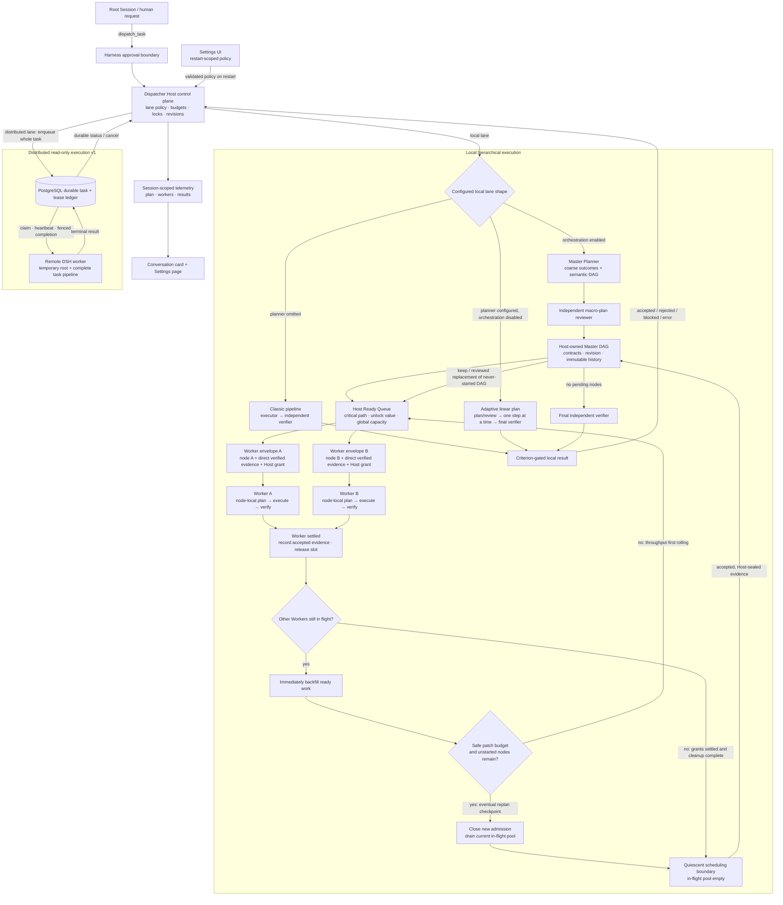
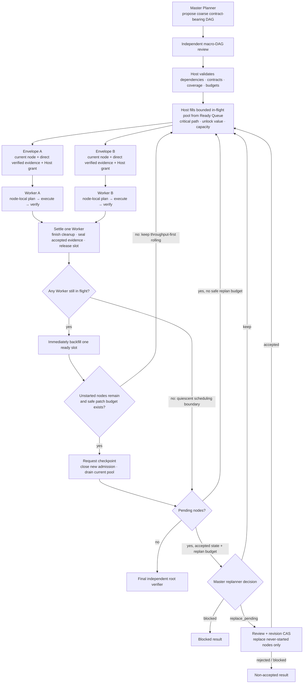

# Architecture and execution model

[Documentation index](./README.md) · [Project overview](../README.md) · [简体中文](./zh-CN/architecture.md)

This document contains the detailed control-plane, planning, scheduling, verification, and Web progress contracts for `dsh-task-dispatcher`.


## Architecture



The local and distributed paths deliberately have different recovery models.
Local execution can expose live phases, Agents, dependencies, and dynamic plan
revisions, but loses that in-memory state if its process dies. Distributed v1
survives coordinator or worker replacement through PostgreSQL leases, yet a
lost worker reruns the complete read-only task instead of resuming mid-plan.
Writable recursive worktree primitives exist as experimental Host libraries,
but are not connected to active lanes or remote workers.

The architecture separates three different kinds of knowledge. The Master
Planner sees the root objective and constructs the macro DAG, but does not
write commands or implementation steps. The Host sees the complete validated
DAG and all resource state, and is the only scheduler. A Worker sees only its
current node contract, directly required accepted evidence, global invariants,
and an attenuated Host grant; it does not receive sibling or future nodes.

| Mode | Plan shape | Revision point | Parallelism | Durable state |
|---|---|---|---|---|
| Local classic | No plan: executor then verifier | Optional executor retry only | One child phase at a time | Process-local |
| Local adaptive | Ordered Master Plan | After a verified step, replace only the pending suffix | One plan step at a time | Process-local |
| Local orchestration | Contract-bearing macro DAG; optional node-local plans inside Workers | At a natural or bounded eventual quiescent checkpoint, replace only never-started nodes | Prioritized rolling backfill with bounded replan checkpoints | Process-local |
| Distributed v1 | One worker runs the complete classic or adaptive pipeline | Inside that worker; recursive DAG is disabled | Across whole tasks/workers, not across machines within one task | Envelope, lease, cancellation, and terminal result |

### Internal code boundaries

`dispatcher.js` remains the compatibility facade and composition root. The
large control-plane concerns are split behind that unchanged public entry:

| Module | Responsibility |
|---|---|
| `dispatcher-child-runner.js` | Bounded child startup, structured-output capture, cancellation, and exact-once cleanup |
| `dispatcher-contracts.js` | Single-source model, task-result, and tool JSON Schemas |
| `dispatcher-policy.js` | Lane policy, cross-field validation, Settings persistence, and restart-scoped configuration RPC |
| `dispatcher-telemetry.js` | Session projections, retention, watches, revisions, and loopback telemetry RPC |
| `dispatcher-shared.js` | Side-effect-free guards, clipping, path containment, and contained diagnostic logging |
| `dispatcher-tools.js` | Model-facing dispatch, durable status, and cancellation tool adapters |
| `dispatcher.js` | Planning/execution state machines, runtime lifecycle, Cordis `apply`, and compatibility re-exports |

The dependency direction is one-way: focused modules may depend on the shared
leaf, while none imports the `dispatcher.js` facade. Package-root and
`/dispatcher` exports are tested name-for-name and by object identity so future
refactors cannot silently break consumers.

## What it guarantees

For every `dispatch_task` call, the plugin:

1. Validates the task against a deployment-owned lane.
2. Uses the original isolated executor-to-verifier pipeline when the lane has
   no `planner` route.
3. When a `planner` is configured, requires a structured initial plan, sends
   that proposal to a separate plan-review child, and executes only an accepted
   plan. If the initial read-only planner emits plain text instead of recording
   the required structured result, the Host may start one fresh protocol retry
   when enough child-run budget remains for review, one executable step, its
   verifier, and final verification. Plain text is never parsed or accepted as
   a plan.
4. Runs an executor and an independent verifier for exactly one plan step at a
   time. Only the Host can mark that step complete.
5. After a completed step, while pending work and patch budget remain, lets the
   planner keep the remaining plan, report a blocker, or propose replacement of
   only the pending suffix. Every proposed replacement receives another
   independent plan review before the Host commits it.
6. After all steps complete, runs a final global verifier against the immutable
   original task and all original acceptance criteria.
7. Accepts only when the applicable verifier returns exactly one result for
   every criterion, every result is `pass`, and every pass has non-empty
   evidence.
8. Repeats an executor or permits final-review remediation only when deployment
   policy explicitly enables `retryOnRevise` and the relevant attempt, patch,
   child-run, and deadline budgets still permit it.
9. For an orchestration-enabled lane, maintains a bounded in-flight pool from a
   dependency-ready queue. The Host ranks ready nodes by critical-path cost,
   immediate unlock value, and downstream reach before applying configured
   capacity. When one Worker settles while another remains in flight, the Host
   immediately admits newly ready work into the released slot. If that refill
   leaves unstarted nodes and safe patch budget remains, the Host then closes
   further admission and drains the current pool, guaranteeing an eventual
   quiescent checkpoint instead of starving dynamic planning. Without safe
   replan budget it keeps rolling for throughput. Only at a quiescent
   checkpoint may the Master keep the remaining DAG, report a blocker, or
   propose replacement of nodes that have never started. A replacement is
   independently reviewed and committed with a compare-and-set plan revision.
   Running and completed nodes are never patch targets.

An accepted result is **model-verified**. It is not a formal proof, a security certification, or human approval. The executor's own success claim is never sufficient for acceptance.

Other safety properties include:

- Root-authorized dispatch: raw `dispatch_task` calls are accepted only from an
  exact live root Session. An orchestration child cannot recursively dispatch
  work itself; only the Host may create a validated descendant from an
  orchestration proposal.
- For local lanes, one active task per overlapping workspace tree in the
  current DSH process. Canonical parent/child paths conflict, and the
  reservation is kept in process-global state so a plugin hot reload cannot
  overlap an older task. Distributed v1 permits concurrent access only because
  all admitted worker tools are read-only.
- Host-generated task ids; a caller cannot choose them.
- Host-owned master-plan identity, revision, status, evidence, and immutable
  history. Planner children can propose typed data, but cannot mutate plan
  state. A revision patch must match the current Host revision. Completed
  linear steps form an immutable prefix; completed orchestration nodes form an
  immutable set. Neither can be replaced, removed historical ids cannot be
  reused, and plan reviews reject proposals that repeat completed effects.
- Mandatory lane criteria cannot be removed or replaced by a tool call. A caller may only add stricter criteria with new ids.
- Bounded task text, criteria, deliverables, attempts, plan size, plan patches,
  total child runs, whole-task runtime, per-child runtime, output, cleanup, and
  job output.
- Child tool allow-lists. An empty verifier list creates a model-only verifier.
- Raw recursive and global-rule capabilities remain denied to executor lanes:
  `dispatch_task`, `dispatch_status`, `dispatch_cancel`, `subagent`,
  `subagent_fork`, `workflow`, `ralph`, `prompt_rewrite_rules`, and
  `trigger_rules` cannot be added to an executor allow-list. Host orchestration
  does not expose these tools to its children.
- Planner and verifier tools are restricted to the built-in read-only set
  (`read`, `read_image`, `glob`, and `grep`); planning and verification cannot
  mutate the candidate.
- Child start, result, timeout, cancellation, and cleanup failures become structured task failures.
- If local child cleanup cannot be confirmed, the result sets
  `workspaceQuarantined: true` and the process keeps that workspace reserved;
  no replacement or hot-reloaded local dispatcher may start another task
  there. A distributed cleanup failure is also non-accepted and asks operators
  to replace or inspect that worker.
- Unexpected pipeline exceptions are contained and observed instead of becoming unhandled Promise rejections.
- For local lanes, a process-local per-lane circuit opens after repeated infrastructure errors and cools down before accepting more work.
- Dispatch always requires the normal Harness **Allow once** approval.

`spawn` is the recommended transport because the task specification is standalone. `fork` additionally gives a child the parent's completed history, but it does not include the currently executing dispatch tool call.

## Execution modes and master plans

Omitting `planner` preserves the original pipeline: one task-wide executor run
produces structured evidence, then a separate verifier evaluates the complete
task. `retryOnRevise` may repeat that executor up to `maxAttempts`; no master
plan is created.

When `planner` is configured on a lane without recursive orchestration, the
pipeline is:

```text
initial planner -> independent plan review
  -> step executor -> independent step verifier
  -> keep plan | independently review and replace pending suffix
  -> ...
  -> final independent verifier over the original task
```

The initial plan must cover every original criterion and deliverable. The Host
assigns the plan id, owns its monotonically increasing revision and append-only
history, and is the only component allowed to change step status or record
evidence. A planner patch is compare-and-set against the current revision. It
may return `keep`, `blocked`, or `replace_pending`; it cannot edit the completed
prefix. Removed historical step ids cannot be reused, and a replacement cannot
weaken coverage of the immutable task.

An accepted step becomes part of the immutable completed prefix before any
replanning. Once no pending step remains, a final verifier must independently
accept every original task criterion with evidence. If that verifier requests
revision and retry policy allows it, the planner may propose bounded remediation
steps in the still-available plan suffix; otherwise the task is rejected or
blocked.

Master-plan state is **process-local** to the process executing the task. It is
included in the eventual task result for inspection, but this release has no
durable phase or plan journal and cannot resume a plan, child run, budget, or
pending suffix after that process restarts. A local task is therefore lost with
its process. A distributed task envelope and its eventual terminal result are
durable, but a worker failure causes the complete task pipeline to be leased
and run again rather than resuming its interrupted plan.

## Host-owned recursive orchestration (v1)

Recursive orchestration is an opt-in property of a configured lane. In v1 it
is deliberately limited to **local + `spawn` + read-only** execution with
`workspaceMode: read-shared`. It is not enabled on the bundled
`general-analysis` lane. Both the orchestration lane and its fixed
`childLane` must run locally, use `spawn`, and expose only `read`, `read_image`,
`glob`, and `grep`. The child lane is selected by deployment configuration,
must be a `general` lane, and cannot add tools that the parent lane does not
already have in the corresponding planner, executor, or verifier phase.
`isolated-write` is present only as a reserved configuration value and is
rejected by the Host while orchestration is enabled.

The v1 dynamic-DAG lifecycle is:



### Master, Host, and Worker information boundaries

The **Master Planner** proposes typed node ids, outcomes, dependencies,
input/output contracts, logical deliverable scope, local acceptance criteria,
coverage of immutable root criteria, and resource-class/estimated-cost hints.
It should decompose the project at independently verifiable outcome boundaries.
It must not prescribe commands, exact edits, model calls, tools, providers,
working directories, child lanes, budgets, grants, or the number of Workers to
start. Those are implementation and authority decisions, not macro-plan data.

The **Host Scheduler** owns the complete validated DAG and the live truth. It
derives the ready set from accepted dependencies, ranks candidates by critical
path, immediate unlock count, and downstream reach, then applies active
capacity before minting any grant. The public scheduler core can additionally
enforce per-provider, model, resource-class, workspace, and conflict-key
quotas. During rolling execution the active dispatcher invokes that core as
Workers settle, except after it deliberately closes admission for an eventual
replan checkpoint. Its lane runtime currently relies primarily on the
whole-tree `maxConcurrentNodes` limit, its fixed child-lane/workspace context,
and the FIFO Host grant ledger. The broader provider/model/resource quota
surface is available to trusted Host integrations; it is not currently exposed
as lane runtime configuration.

The **Worker** receives a least-context envelope: its current node outcome,
local input/output and acceptance contracts, global invariants relevant to that
node, and bounded verified evidence for directly referenced dependencies,
plus its bounded Host grant. It does not receive the complete DAG, sibling
objectives, future nodes, or authority to edit the Master Plan. A child lane
with its own planner may form a node-local mini-plan, but that mini-plan remains
inside the Worker pipeline and never becomes a global DAG patch by itself.

Each Worker runs the complete pipeline of its fixed lane and must be
independently accepted before it can satisfy a dependency. Accepted child
reports are sealed into bounded dependency evidence for downstream nodes and
the final root verifier; they are never automatic proof that the root task
succeeded.

The current DAG is Host-owned. Rolling execution begins throughput-first:
whenever one Worker settles while at least one other Worker remains in flight,
the scheduler recomputes the ready queue and may immediately start an accepted
dependency's newly unlocked critical successor. It does not wait for an
unrelated slow sibling before using that released slot.

Rolling is deliberately bounded so it cannot starve dynamic planning forever.
After one refill, if unstarted nodes still remain, every recorded outcome is
accepted, and enough patch/model-run budget remains for safe replanning and
review, the Host requests a checkpoint. It closes new admissions but does not
cancel current Workers; their bounded child deadlines let the existing pool
drain to an eventual quiescent state. If those safe replan conditions are not
met, the Host does not create an unnecessary throughput bubble and continues
rolling admissions instead.

The Master may change the DAG only when the in-flight pool drains completely,
every child grant has settled, and cleanup has finished. This is the
**quiescent scheduling boundary**. The replanner receives bounded structured
evidence, not raw child streams. `keep` leaves the revision unchanged;
`replace_pending` supplies the complete new never-started DAG and receives a
separate plan review. The Host preserves every completed node byte-for-byte,
never includes a running node in the patchable set, rejects mutation of a
retained pending id, forbids reuse of any removed id, revalidates dependencies
and immutable criterion/deliverable coverage, and commits only if the proposed
`baseRevision` still matches. New admissions occur only after that atomic plan
decision, so a removed node can never start with stale authority. No patch can
alter a running or completed node.

Dynamic patches are optional and budgeted by `maxPlanPatches` plus the shared
model-run ledger. Mandatory pending children and the final verifier are funded
before optional replanning. If no safe surplus remains, the Host continues the
reviewed DAG without starting a replanner. This v1 replans only from accepted
evidence accumulated before a quiescent boundary: failed work still terminates
or leaves dependency-blocked work according to `failureMode`, and a
final-verifier gap does not create a new DAG.

One Host-owned authority ledger is shared by the entire recursive tree. Opaque
grants monotonically attenuate the configured depth, total task-node, per-node
fan-out, concurrent-node, model-run, and deadline budgets. Child reservations
are all-or-none, model runs are charged before they start, and an ancestor
cannot settle while a descendant still owns authority. Cancellation revokes
the grant tree; budget exhaustion, replay, expiry, policy drift, or an invalid
proposal fails closed with a non-accepted task result. A configured child lane
may itself be orchestration-enabled, but only within the same shared limits and
the statically validated fixed-lane graph.

This feature does not relax the root-only tool boundary. Children never receive
raw `dispatch_task`, `dispatch_status`, `dispatch_cancel`, `subagent`,
`subagent_fork`, `workflow`, `ralph`, `prompt_rewrite_rules`, or
`trigger_rules` authority. Models can propose work; only the Host can mint a
bounded child grant and start that work.

Like other local master plans, the DAG, grants, live child state, and progress
journal are process-local. V1 does not split one recursive tree across remote
workers and cannot resume it after a Host restart.

### Public Host-side planning modules

The package exports two pure planning/scheduling modules introduced for this
hierarchical boundary. They do not run models, start children, or grant tools:

- `dsh-task-dispatcher/macro-planning` exports `normalizeMacroPlan`,
  `validateMacroPlan`, and `buildWorkerEnvelope`. It strictly validates a
  contract-bearing macro DAG, rejects implementation/authority fields, checks
  dependencies, root coverage, contract references, historical ids, and
  repository-relative scope proposals, then projects one deeply frozen Worker
  envelope without the complete DAG. The active dispatcher uses the same
  hierarchy and compatible orchestration contracts, while this standalone
  module is the reusable exact boundary for further Host integration.
- `dsh-task-dispatcher/ready-scheduler` exports
  `validateReadySchedulerDag` and `scheduleReadyNodes`. It is a deterministic,
  side-effect-free admission core with critical-path/unlock prioritization,
  global and per-resource capacity, conflict keys, failure propagation, and
  diagnostics. The dispatcher calls it repeatedly to backfill released slots
  while other Workers remain in flight, unless the Host has closed admission
  to reach a bounded replan checkpoint. Per-provider, model, resource-class,
  workspace, and conflict-key limits remain public Host-core inputs rather
  than active lane runtime settings.

The package also exports two experimental mutation-oriented Host building
blocks. They remain tested libraries, not active dispatcher capabilities:

- `dsh-task-dispatcher/workspace-isolation` validates repository-relative write
  scopes and contains path-lease and Git workspace command-planning primitives.
  The dispatcher does not instantiate it, does not place child Sessions in its
  worktrees, and does not integrate or promote its candidates. Writable
  recursive orchestration therefore remains unavailable.
- `dsh-task-dispatcher/config-proposals` contains bounded configuration-proposal,
  approval, compare-and-set, audit, and rollback primitives. It is not wired to
  `dispatch_task`, the Settings save path, or active lane policy. A dispatched
  task cannot use it to persistently change configuration or global rules.

All four modules require a trusted Host to provide live state and enforce their
decisions. The first two are pure contract/scheduling boundaries; the latter
two may change while their mutation workflows remain experimental. Merely
importing or packaging any module does not grant a model a tool, workspace, or
mutation authority. In particular, validating a `workspace-write` proposal
with `macro-planning` does not make writable orchestration available: active
orchestration still rejects every workspace mode except read-only
`read-shared`.

## Web execution view

The bundle includes a Web client module. Each conversation header gets a
compact summary such as `Plan 2/5 · 1 active Agent`. The summary prioritizes
root tasks that are still running: plan totals count only their macro or linear
steps, while the Agent count includes active descendants without counting the
same work again through each Worker-local plan. Before a local master plan
exists, it shows the root task's current phase, such as `Creating initial
plan`, instead of the misleading `Plan 0/0`. When no root task is running, it
shows only the newest terminal root's status and plan progress rather than
accumulating history. Open it to see:

- every recent or active root dispatcher task in that exact Session, with each
  recursive Worker task nested under its owning macro node;
- for a durable task, its pool, queued/running/terminal placement state, remote
  node id, delivery count, lease generation and expiry, and cancellation flag;
- for a local task, a node-count state composition plus **working now**,
  **dependencies met**, and **waiting on dependencies** summaries; only a Host
  `completed` step counts as completed, so an accepted child remains
  `joining` until its parent seals the evidence;
- for a local linear task, each step's prerequisite as a vertical dependency
  chain; macro DAG nodes are a semantic list and are never connected merely
  because they are adjacent in the planner's array;
- for an orchestration parent, an explicit **Master Plan / macro DAG** label
  with recursive dependency-failure propagation and the local node tasks the
  Host currently reports as running;
- for an orchestration child, an explicit **Worker node-local execution** label
  rather than presenting its private pipeline as another global plan;
- for a local task, the planner, executor, reviewer, or verifier attached to
  each step, plus the child Agent id and selected provider/model; and
- reconnecting, blocked, rejected, cancelled, and error states with both text
  and color-independent status markers, plus terminal model-verification,
  failure-class, and workspace-quarantine facts.

The progress composition is a count of published nodes or steps, not a weighted
percentage. `Dependencies met` means only that every published prerequisite is
Host-confirmed complete. It does not claim that the node has passed plan review,
entered the Ready Queue, received an execution slot, or will run next. The Web
view deliberately does not infer queue ordering, critical path, slot capacity,
slot utilization, or an ETA from the current telemetry protocol.

Distributed v1 deliberately does not guess. While a remote task is running,
the durable ledger proves its task state, pool, node, claim generation, lease,
delivery count, and cancellation request, but it does not persist the worker's
current planner/executor/verifier phase, child Agent id, selected model, or live
master-plan snapshot. The card therefore says `Running remotely (phase
unreported)` and shows no invented Agent. The validated terminal result can
include the final master plan; a durable phase-and-plan progress journal is a
future protocol extension.

The ordinary adaptive master-plan contract remains linear: the Host executes
its first pending step and each step depends on the preceding step. An
orchestration-enabled local lane instead publishes its validated DAG and the
Host may keep a bounded dependency-ready Worker pool filled in parallel. The
view renders the reported `dependsOn` edges, mechanically dependency-ready
nodes, Host-reported running node tasks, and active Agents for either shape; it
does not invent queue rank, slot occupancy, dependencies, Workers, admissions,
or parallelism that Host telemetry did not report.

The Host publishes bounded, session-filtered snapshots through a loopback-only
RPC channel. The browser takes a baseline snapshot and then uses
cancellation-aware long polls. It ignores stale replies, accepts a fresh
baseline after a Host restart, and keeps the last valid view while reconnecting.
Visualization, listener, decoding, and transport failures are contained and
cannot alter task execution or acceptance. Snapshots intentionally omit task
prompts, workspace paths, criterion evidence, and other large or sensitive
payloads. The PostgreSQL task record is durable; this Web read-model is not, so
a coordinator restart clears the live card. Use `dispatch_status` from the
exact origin Session when the durable ledger is the source of truth.


---

[Documentation index](./README.md) · [Project overview](../README.md)
