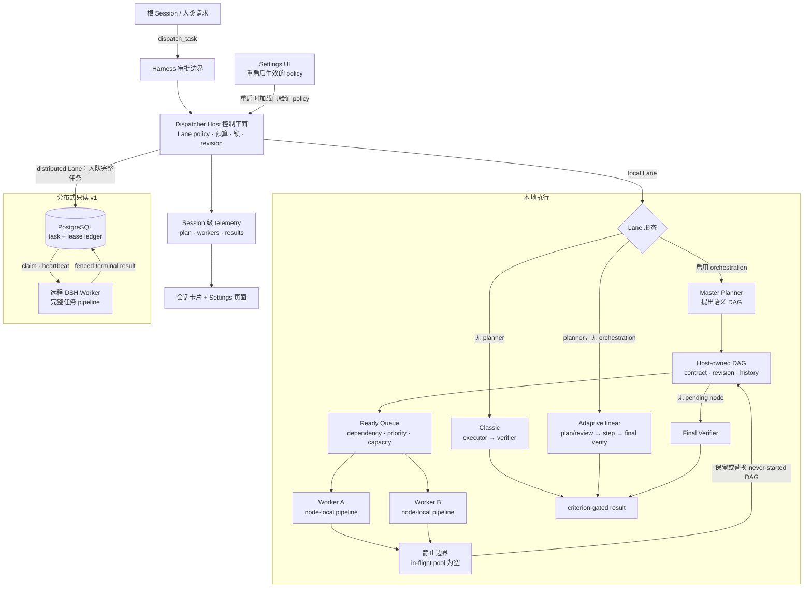
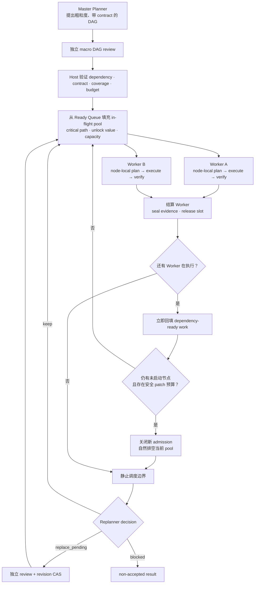

# 架构与执行模型

[中文文档索引](./README.md) · [返回中文首页](../../README.zh-CN.md) · [English](../architecture.md)

本文详细说明 classic pipeline、自适应线性 Master Plan、递归 DAG orchestration，以及 Master Planner、Host Scheduler、Worker 之间的权限与信息边界。

## 总体架构



本地与分布式路径采用不同恢复模型。本地执行可以公开实时 phase、Agent、dependency 和 plan revision，但状态只在进程内。分布式 v1 通过 PostgreSQL lease 承受 coordinator/worker 替换，却会在 lease 丢失后从头重跑完整只读任务，不会从 Planner 或 Executor 中途恢复。

## 三种本地执行形态

| 模式 | Plan | Revision | 并行度 | 持久性 |
|---|---|---|---|---|
| Local classic | 无 plan；Executor 后接 Verifier | 仅可选 Executor retry | 每次一个 child phase | 进程内 |
| Local adaptive | 有序 Master Plan | step 验证后仅替换 pending suffix | 每次一个 plan step | 进程内 |
| Local orchestration | 带 contract 的 macro DAG；Worker 内可有 node-local plan | 静止 checkpoint 只替换 never-started node | 依赖就绪的滚动回填 | 进程内 |

### Classic pipeline

Lane 省略 `planner` 时，Executor 为完整任务生成结构化证据，独立 Verifier 再评估完整任务。`retryOnRevise` 可以让 Executor 最多运行 `maxAttempts` 次，但不会创建 Master Plan。

### 自适应线性 Master Plan

配置 `planner` 且不启用 orchestration 时：

```text
initial planner -> independent plan review
  -> step executor -> independent step verifier
  -> keep plan | independently review and replace pending suffix
  -> ...
  -> final independent verifier over the original task
```

初始 plan 必须覆盖所有原始 criterion 与 deliverable。Host 分配 plan id，持有单调递增 revision 和 append-only history，并且是唯一能修改 step status 或记录 evidence 的组件。

Planner patch 针对当前 revision 做 compare-and-set，只能返回 `keep`、`blocked` 或 `replace_pending`。completed prefix 不可编辑；历史上移除的 step id 不能复用；替换不能削弱原任务 coverage。

accepted step 会先进入不可变 completed prefix，然后才能 replan。没有 pending step 后，Final Verifier 必须基于证据通过所有原始 criterion。Final Verifier 请求 revise 时，只有 retry、patch、child-run 与 deadline 预算仍允许，Planner 才能提出受限 remediation suffix。

普通 Markdown Planner output 不是 protocol result。缺少要求的 structured output 时，Host 不会把文本解析成 plan；只有预算足够时才可能启动一次全新的 protocol retry。

## 由 Host 持有的递归 orchestration

v1 只支持 local + `spawn` + `workspaceMode: read-shared`。parent 和固定 `childLane` 都必须只暴露 `read`、`read_image`、`glob`、`grep`。`isolated-write` 是保留值，Host 会拒绝激活。



### Master Planner 的边界

Master Planner 提出：

- typed node id、outcome 与 dependency；
- input/output contract；
- logical deliverable scope 与局部 acceptance criteria；
- immutable root criterion coverage；
- resource-class/estimated-cost hint。

它应在可独立验证的 outcome 边界拆解项目，不能规定 command、exact edit、model、tool、provider、working directory、child Lane、budget、grant 或 Worker 数量。这些是 Host authority，不是 macro-plan data。

### Host Scheduler 的边界

Host 持有完整已验证 DAG 与实时资源状态。它根据 accepted dependency 推导 ready set，按 critical path、immediate unlock count 与 downstream reach 排序，再应用 capacity。

`maxConcurrentNodes` 只是 admission 上限，不要求填满。只有 dependency-ready node 可以进入 Worker pool；objective 中的“spawn four agents”不能创建权限。

活动 runtime 主要使用全树 `maxConcurrentNodes`、固定 child-Lane/workspace context 和 FIFO Host grant ledger。公开 Ready Queue core 还支持 per-provider、model、resource-class、workspace 和 conflict-key quota，但这些尚未暴露为活动 Lane runtime setting。

### Worker 的边界

Worker 只接收：

- 当前 node outcome；
- 本地 input/output 与 acceptance contract；
- 与该 node 相关的 global invariant；
- 直接引用 dependency 的受限 verified evidence；
- 弱化后的 Host grant。

Worker 看不到完整 DAG、sibling objective 或 future node，也不能编辑 Master Plan。child Lane 有自己的 Planner 时可以建立 node-local mini-plan，但它不会自行变成 global DAG patch。

每个 Worker 都运行固定 `childLane` 的完整 pipeline，必须独立 accepted 后才能满足 dependency。accepted child 仍需 parent Host seal evidence；只有 root Final Verifier 能决定根任务是否 accepted。

### 滚动回填与静止 checkpoint

某个 Worker 结算而其他 Worker 仍在执行时，Host 重新计算 Ready Queue，并立即回填新解锁的 dependency-ready successor，不等待无关慢 sibling。

完成一次回填后，如果仍有 unstarted node、现有 outcome 全部 accepted，且 patch/model-run 预算足够安全 replan 与 review，Host 会关闭新 admission，但不会取消当前 Worker。当前 pool 按 child deadline 自然排空，最终到达 in-flight pool 为空的静止边界。

只有在该边界，Replanner 才能根据受限 structured evidence 返回 `keep`、`blocked` 或 `replace_pending`。替换必须：

- 保留 completed node；
- 不包含 running node；
- 不修改 retained pending id；
- 不复用 removed historical id；
- 重新通过 dependency 与 root coverage 验证；
- `baseRevision` 仍匹配当前 revision。

新 admission 只能发生在原子 plan decision 后。failed work 与 Final Verifier gap 不触发 DAG replan；它们按 `failureMode` 和 verification policy 结束或阻塞任务。

### Authority ledger

整棵递归树共享 Host-owned authority ledger。opaque grant 单调削弱 depth、node、fan-out、concurrency、model-run 和 deadline budget。child reservation 全有或全无，model run 启动前计费，descendant 仍持有权限时 ancestor 不能 settle。

cancellation 会撤销 grant tree。budget exhaustion、replay、expiry、policy drift 或无效 proposal 都 fail closed。child 永远不会获得原始 `dispatch_task`、`dispatch_status`、`dispatch_cancel`、`subagent`、`subagent_fork`、`workflow`、`ralph`、`prompt_rewrite_rules` 或 `trigger_rules`。

## Host-side module 边界

`dispatcher.js` 是兼容 facade 与 composition root；大型职责拆分如下：

| Module | 职责 |
|---|---|
| `dispatcher-child-runner.js` | 有界 child 启动、structured-output capture、cancellation、cleanup |
| `dispatcher-contracts.js` | model、task-result 与 tool JSON Schema |
| `dispatcher-policy.js` | Lane policy、cross-field validation、Settings persistence、config RPC |
| `dispatcher-telemetry.js` | Session projection、retention、watch、revision、telemetry RPC |
| `dispatcher-shared.js` | guard、clipping、path containment、diagnostic logging |
| `dispatcher-tools.js` | dispatch、durable status、cancellation tool adapter |
| `dispatcher.js` | state machine、runtime lifecycle、Cordis `apply`、兼容 re-export |

package 另导出四个 Host-side building block：

- `dsh-task-dispatcher/macro-planning`：`normalizeMacroPlan`、`validateMacroPlan`、`buildWorkerEnvelope`；
- `dsh-task-dispatcher/ready-scheduler`：`validateReadySchedulerDag`、`scheduleReadyNodes`；
- `dsh-task-dispatcher/workspace-isolation`：实验性 write-scope 与 Git workspace primitive；
- `dsh-task-dispatcher/config-proposals`：实验性 proposal、approval、CAS、audit、rollback primitive。

前两个是纯 contract/scheduling boundary。后两个没有接入 `dispatch_task`、Settings save path 或活动 Lane；import module 不会给模型增加 tool、workspace 或 mutation authority。

## Web progress view

Web client 会显示 `Plan 2/5 · 1 active Agent` 等摘要，并区分 root Master Plan 与 Worker node-local execution。视图可展示：

- root task 与嵌套 Worker task；
- local node state composition、working now、dependencies met、waiting on dependencies；
- reported `dependsOn` edge 与 Host-reported running node task；
- Planner、Executor、Reviewer、Verifier child Agent 和 provider/model；
- durable task 的 pool、remote node、delivery、lease 与 cancellation flag；
- blocked、rejected、cancelled、error、model verification 和 quarantine 状态。

`Dependencies met` 只表示 published prerequisite 已由 Host 确认完成，不代表 node 已通过 plan review、进入 Ready Queue、取得 slot 或将下一个运行。progress composition 是 node/step 数量，不是加权百分比；视图不会推测 queue rank、slot utilization 或 ETA。

分布式 v1 不持久 Worker 当前 phase、child Agent 或 live plan，因此运行中的 remote card 会显示 `Running remotely (phase unreported)`。PostgreSQL ledger 是 durable truth；Web read-model 在 Host restart 后重置。

## 验收语义

Host 只有在独立 Verifier 为每一个不可变 criterion 恰好返回一个结果、全部为 `pass` 且 evidence 非空时才接受任务。Executor self-report 永远只是证据。

| Status | 含义 |
|---|---|
| `accepted` + `modelVerified: true` | 独立 Verifier 已基于证据通过所有 criterion |
| `rejected` | Plan Reviewer 或 Verifier 拒绝 proposal/evidence/result |
| `blocked` | pipeline 报告具体 blocker |
| `cancelled` | authority chain 已取消并 cleanup |
| `error` | task 或 infrastructure boundary 失败 |

模型验收不是形式化证明、安全认证或人工批准。

## 进一步阅读

- [配置参考](./configuration.md)
- [分布式只读执行](./distributed.md)
- [安全与运维](./security-and-operations.md)
- [使用示例](./examples.md)
